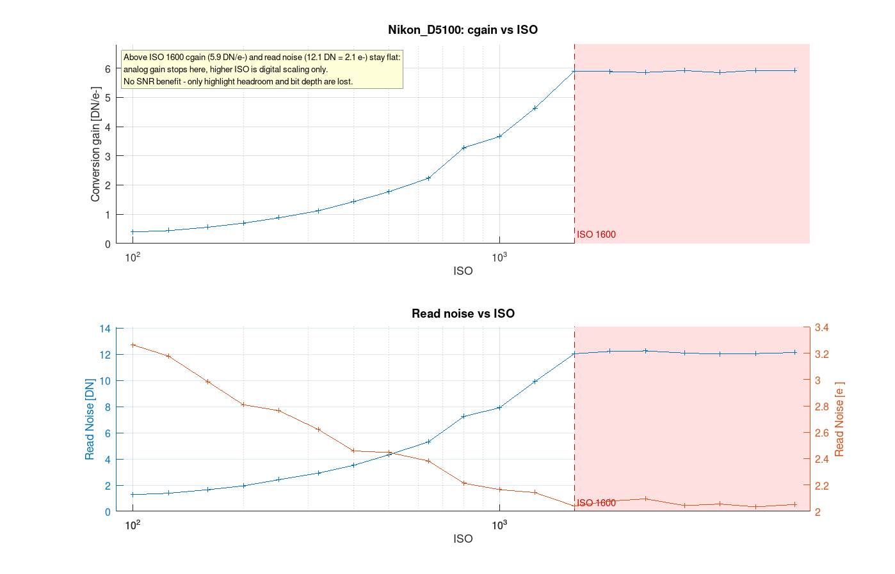
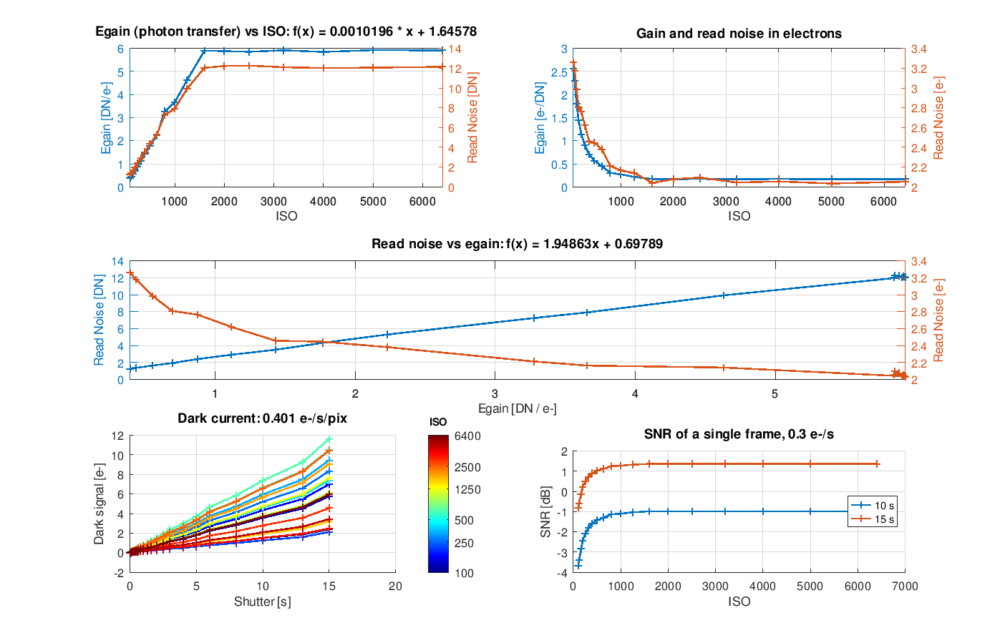
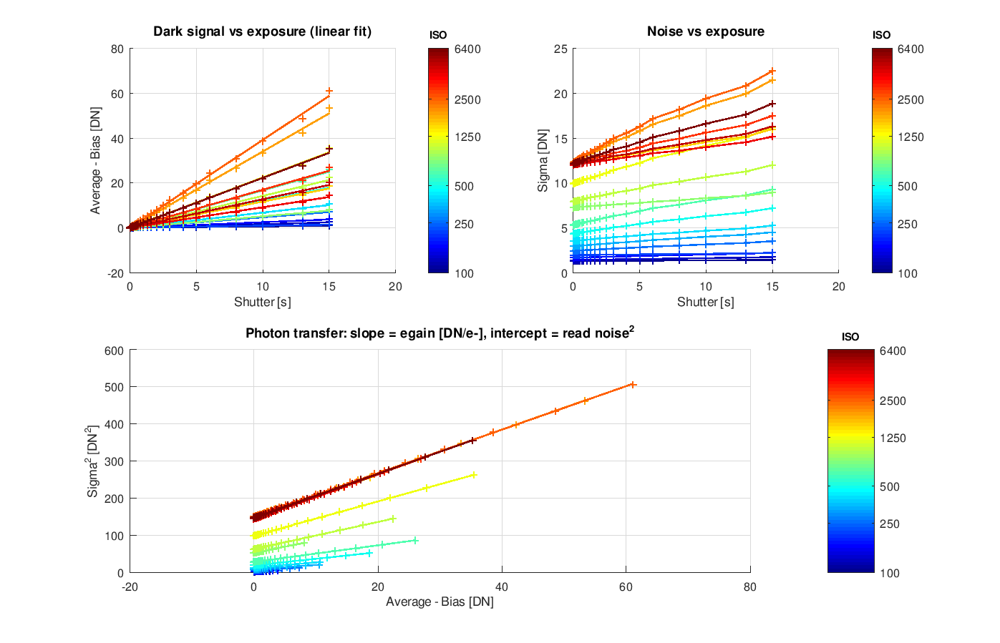
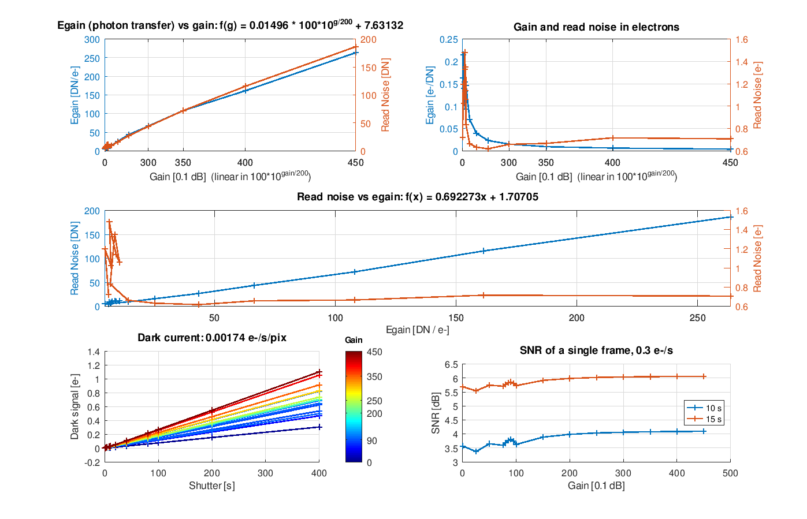
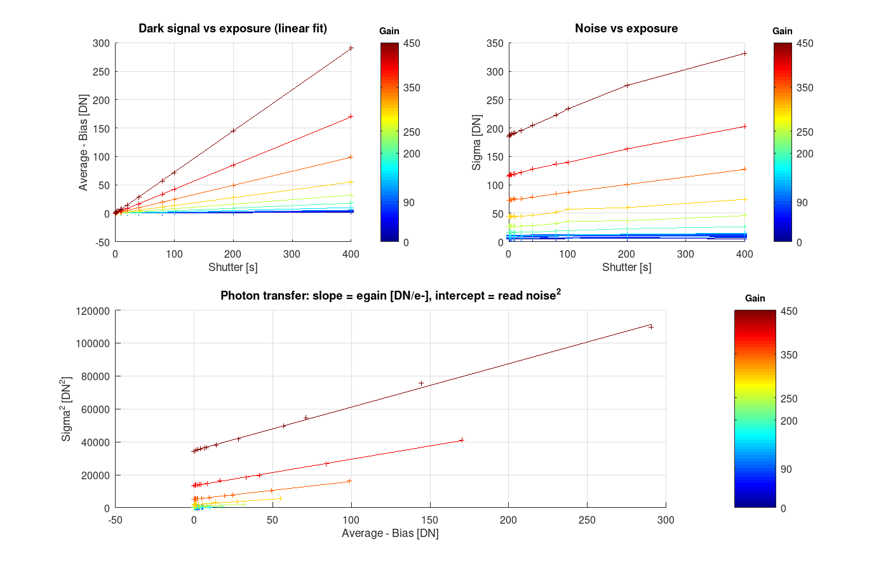
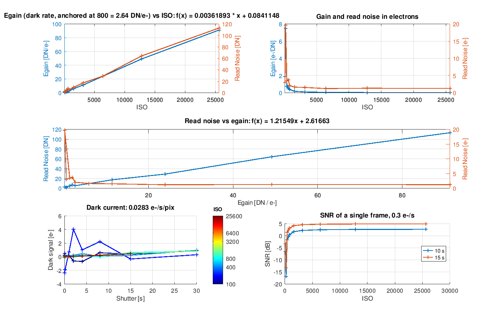
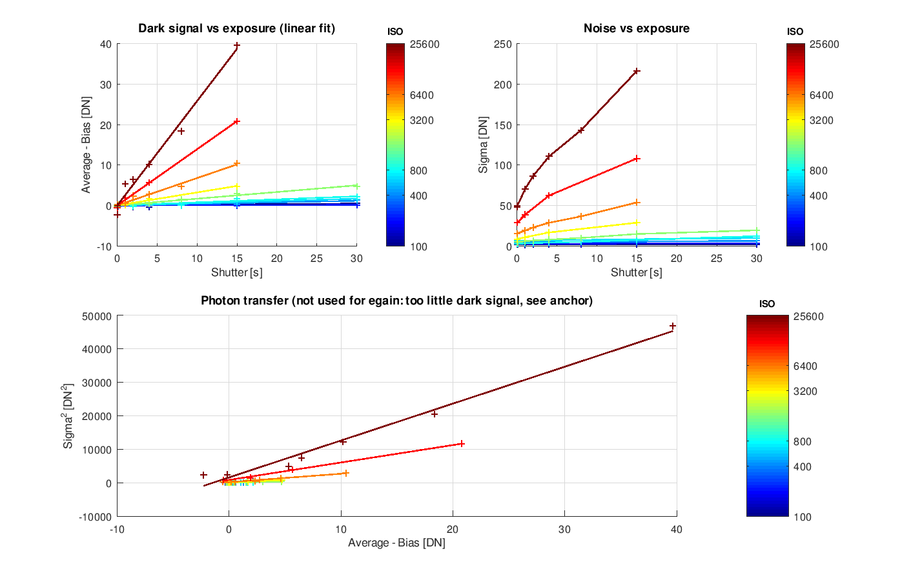

# Camera sensor characterization

🇬🇧 English | [🇵🇱 Polski](README.pl.md)

Derives a sensor noise model (bias, egain, read noise, dark current) from series of
dark frames taken at different ISO/gain settings and exposure times.
Method: https://www.brisk.org.uk/photog/d3readn.html

## Directory layout

```
frames/<camera>/          dark frames in FITS (astro cameras write here directly)
frames/<camera>/raw/      DSLR: RAW files (NEF etc.), subdirectories allowed
frames/<camera>/fits/     DSLR: FITS produced by raw2fits.sh
stats/<camera>.csv        statistics from frames2stats.py
plots/<camera>_*.png      plots saved automatically by sensor_plot
```

`<camera>` is the key throughout the pipeline: frames directory, CSV file,
`analysis.name` and the `case` in `sensor_models.m`.

## Pipeline

```
frames/<camera>/raw/**/*.nef  (DSLR)
  │  ./gphoto2_take.sh          capture over USB (optional)
  │  ./raw2fits.sh <camera>     RAW → FITS (Siril)
  ▼
frames/<camera>/**/*.fit[s]   (frame pairs for every ISO × exposure)
  │  ./frames2stats.py <camera>
  ▼
stats/<camera>.csv            ISO; shutter [s]; average [DN]; sigma [DN]
  │  sensor_characterize('<camera>')
  │    ├─ sensor_fit          linear fits → analysis struct
  │    ├─ sensor_plot         plots (fig 1: input data, fig 2: model) → plots/<camera>_{input,model}.png
  │    └─ sensor_print_model  prints ready-to-paste `camera` struct
  ▼
sensor_models.m               paste the printed struct as a new `case`
```

## Step by step – new camera

1. Take pairs of dark frames for every ISO/gain × exposure time combination
   (at least 2 frames per combination, several exposures from very short to long).
   DSLR over USB: set `ISOS`/`TIMES` in `gphoto2_take.sh` and run `./gphoto2_take.sh`
   – it writes `frames/<camera>/raw/dark_iso<ISO>_<time>_<n>.nef`, e.g. `dark_iso800_0-01s_2.nef`
   (time in seconds with the dot replaced by `-`; camera name from `gphoto2 --auto-detect`).
2. Astro camera: put the FITS files in `frames/<camera>/` (subdirectories allowed – the script searches recursively).
   DSLR: put RAW files in `frames/<camera>/raw/` and convert:
   ```sh
   ./raw2fits.sh <camera>            # → frames/<camera>/fits/
   ```
3. Compute statistics:
   ```sh
   ./frames2stats.py <camera>        # → stats/<camera>.csv
   ```
   Gain is read from the `ISOSPEED` (DSLR) or `GAIN` (astro camera) header keyword.
   By default the whole frame is used with no pixel selection; `--win`/`--clip` are only for
   problematic data (see script description).
4. In Octave:
   ```octave
   sensor_characterize('<camera>')
   ```
5. Copy the console output into `sensor_models.m` as a new `case`.

## Scripts

### gphoto2_take.sh
Detects the single connected camera (`gphoto2 --auto-detect`), switches to RAW and for every
`ISOS` × `TIMES` combination takes `FRAMES` (default 2) frames into `frames/<camera>/raw/`.
`TIMES` values use the format reported by `gphoto2 --get-config capturesettings/shutterspeed`.

### raw2fits.sh <camera>
Finds every directory with RAW files under `frames/<camera>/raw/` and converts them with Siril
(no debayer, 32 bit) into `frames/<camera>/fits/<dir>_NNNNN.fit`. `ISOSPEED`/`EXPTIME` headers are preserved.
The `fits/` directory is wiped before conversion.

### frames2stats.py [--win N] [--clip S] <camera>
Groups FITS files from `frames/<camera>/` by (ISO, EXPTIME), takes the first two frames of each group and computes
`average` = mean, `sigma` = std(frame1 − frame2)/√2 over the whole frame.
Writes `stats/<camera>.csv` (`;`-separated).

By default no pixels are rejected – camera noise has heavy tails (RTS pixels etc.) and that is
real noise the model should describe. Options for faulty data only:
- `--win N` – use only the central N×N px (e.g. edge gradient / amp glow as in the D5100 with hacked firmware),
- `--clip S` – ignore pixels further than S robust sigmas (MAD) from the median in either frame
  (corrupt blocks of value 4128 in D5100 NEFs, see `frames/Nikon_D5100/CORRUPTED.txt`).
  Note: on heavy-tailed noise it biases sigma low (Z6 II: 0.5–5 %, up to 13 % at ISO 6400 / 1/100 s).

Parameters used: `Nikon_D5100` – `--win 4096 --clip 8`; `Nikon_Z6_2`, `ASI2600MM_5deg` – defaults.

### analysis = sensor_characterize(name, anchor = sensor_anchor(name))
Main entry point. Loads `stats/<name>.csv` → `sensor_fit` → `sensor_plot` → `sensor_print_model`.
Returns the `analysis` struct (e.g. for `sensor_plot_iso_limit`).

### analysis = sensor_fit(data, anchor = [])
From the `[ISO shutter average sigma]` matrix computes, for every ISO:
- `bias` – intercept of the average(shutter) line
- `dark_rate` [DN/s] – slope of the average(shutter) line
- `egain_pt` [DN/e-] – slope of the sigma²(average − bias) line (photon transfer)
- `read_noise` [DN] – √ of that line's intercept
- `dark_current` [e-/s/pix] – `dark_rate / egain`
- `iso2egain`, `egain2read_noise` – linear fits between ISO and the parameters;
  `has_iso` tells whether ISO scales linearly (DSLR) or logarithmically (0.1 dB gain, astro cameras)
- `setting` – ISO/gain values as set on the camera (for labels)

The number of exposures may differ between ISO settings (missing entries are `NaN`).

**Where egain comes from.** Photon transfer on darks only works when the dark signal is large
(D5100: 0.4 e-/s). Cameras with low dark current (cooled astro cameras, modern DSLRs) accumulate
< 1 e- over the whole series and the variance grows mostly through hot/blinking pixels – the slope
is random. `anchor = struct('iso', I, 'egain', G)` switches the method: dark current in e-/s does
not depend on ISO, so `dark_rate(ISO) / dark_rate(I)` is the relative egain (the mean is robust to
hot pixels) and `G` (from a datasheet / a single flat pair) fixes the absolute value. Read noise² is
then `sigma² − egain·average`. `egain_source` records which method was used.
Relative egain at low ISO needs long darks (Z6 II: 0.015 DN/s at ISO 100 → several minutes to
rise above the noise of the mean).

### anchor = sensor_anchor(name)
Table of external egain references for cameras that need one (`[]` = photon transfer).

### sensor_plot(analysis)
Fig 1 – input data with fits. Fig 2 – egain, read noise vs ISO, SNR vs ISO.
Lines coloured by log(ISO) (blue = lowest, red = highest) with a colorbar instead of a legend.
Both figures are saved to `plots/<name>_input.png` and `plots/<name>_model.png`.

### sensor_plot_iso_limit(analysis, iso_limit)
Egain and read noise vs ISO (log axis) with the range above `iso_limit` highlighted, where analog
gain no longer increases – saved to `plots/<name>_iso_limit.png`. E.g. for the D5100:
```octave
sensor_plot_iso_limit(sensor_characterize('Nikon_D5100'), 1600)
```

### sensor_print_model(analysis)
Prints the `camera` struct as code to paste into `sensor_models.m`.

### camera = sensor_models(name)
Database of fitted models (`"ASI2600MM_5deg"`, `"Nikon_D5100"`).

### data = sensor_simulate(camera, shutter)
Generates synthetic statistics from a model (inverse of `sensor_fit`).

### sensor_validate(name)
Round-trip test: `sensor_models` → `sensor_simulate` → `sensor_fit` → `sensor_plot`.
The result should reproduce the input model parameters.

## Outside the pipeline

### snr_vs_iso(name)
Experiment: SNR as a function of ISO for a fixed total exposure time.

### counts2mag
Estimating stellar magnitude from ADU counts – notes from a Deneb measurement.

## Results

### Nikon D5100 – ISO above 1600 is digital only

From ISO 1600 upwards egain (5.9 DN/e-) and read noise (12.1 DN = 2.1 e-) stop changing:
analog gain ends at 1600, higher ISO is purely digital scaling.
SNR does not improve, only highlight headroom and bit depth are lost – for astrophotography
there is no point going above ISO 1600.



Full model:




### ZWO ASI2600MM (−5 °C)




### Nikon Z6 II

The darks of this camera carry too little signal for photon transfer (0.015 DN/s at ISO 100), so
egain comes from the dark signal rate anchored at ISO 800 (`sensor_anchor`, provisional value from
Z6 data). From ISO 400 upwards the result is consistent: read noise 3.5 e- (ISO 400–640), drop to
2.1 e- at ISO 800 (dual conversion gain), 1.6 → 1.2 e- above. ISO 100–200 need multi-minute darks
– not reliable yet.



