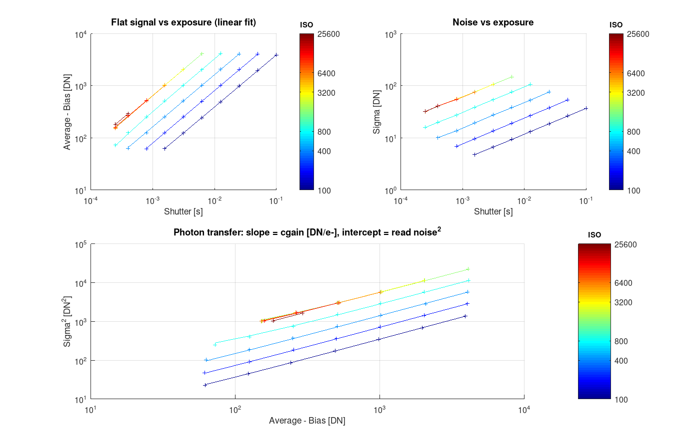
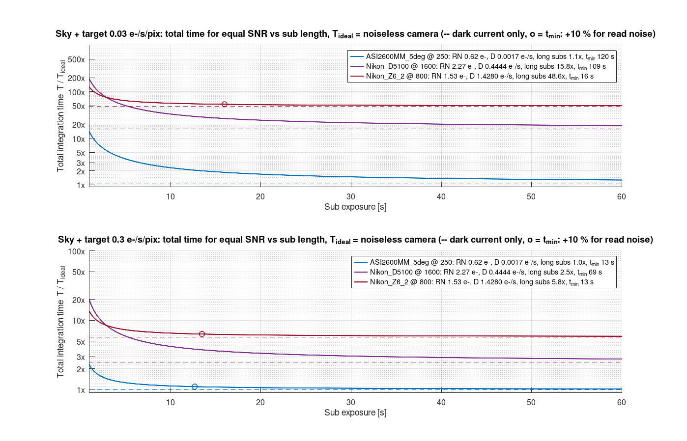
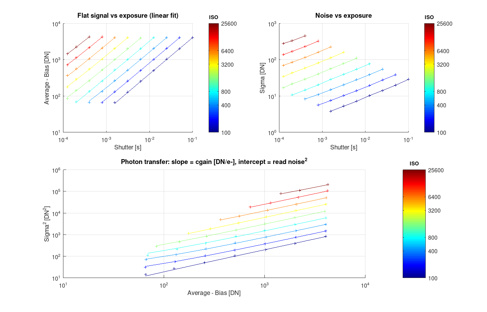

# Charakterystyka sensora kamery

[🇬🇧 English](README.md) | 🇵🇱 Polski

Wyznaczanie modelu szumu sensora (bias, cgain, read noise, dark current) z serii
klatek dark o różnych ISO/gain i czasach ekspozycji.
Metoda: https://www.brisk.org.uk/photog/d3readn.html

## Układ katalogów

```
frames/<kamera>/<typ>/        <typ> = dark | flat (w przyszłości light)
frames/<kamera>/<typ>/*.fits  kamery astro zapisują tu FITS bezpośrednio (mogą być podkatalogi)
frames/<kamera>/<typ>/raw/    DSLR: pliki RAW (NEF itp.), mogą być w podkatalogach
frames/<kamera>/<typ>/fits/   DSLR: FITS wygenerowane przez raw2fits.sh
stats/<kamera>_<typ>.csv      statystyki z frames2stats.py
plots/<kamera>_*.png          wykresy zapisywane automatycznie przez sensor_plot
```

Nazwa `<kamera>` jest kluczem w całym potoku: katalog klatek, plik CSV,
`analysis.name` i `case` w `sensor_models.m`. `dark` jest wymagany; `flat` opcjonalny – jeśli jest,
przejmuje wyznaczanie conversion gain (patrz [Darki + flaty](#darki--flaty-sensor_merge)).

## Potok

```
frames/<kamera>/dark/raw/**/*.nef            frames/<kamera>/flat/raw/**/*.nef   (DSLR)
  │  ./gphoto2_take_darks.sh                    │  ./gphoto2_take_flats.sh        zdjęcia przez USB (opcjonalnie)
  │  ./raw2fits.sh <kamera> dark                │  ./raw2fits.sh <kamera> flat    RAW → FITS (Siril)
  ▼                                             ▼
frames/<kamera>/dark/**/*.fit[s]             frames/<kamera>/flat/**/*.fit[s]    (pary klatek, ISO × ekspozycja)
  │  ./frames2stats.py <kamera> dark            │  ./frames2stats.py <kamera> flat
  ▼                                             ▼
stats/<kamera>_dark.csv                      stats/<kamera>_flat.csv  (opcjonalny)  ISO; shutter; average; sigma
  │  sensor_characterize('<kamera>')
  │    ├─ sensor_fit          dopasowania liniowe darków (i flatów)
  │    ├─ sensor_merge        z flatami: cgain z flatów, RN + prąd ciemny z darków
  │    ├─ sensor_plot         wykresy → plots/<kamera>_{input,model,flat_input}.png
  │    └─ sensor_print_model  drukuje gotowy kod struktury `camera`
  ▼
sensor_models.m                              wklej wydrukowaną strukturę jako nowy `case`
```

## Krok po kroku – nowa kamera

1. Zrób pary klatek dark dla każdej kombinacji ISO/gain × czas ekspozycji
   (min. 2 klatki na kombinację, kilka czasów od bardzo krótkiego do długiego).
   DSLR przez USB: ustaw `ISOS`/`TIMES` w `gphoto2_take_darks.sh` i odpal `./gphoto2_take_darks.sh`
   – zapisze `frames/<kamera>/dark/raw/dark_iso<ISO>_<czas>_<n>.nef`, np. `dark_iso800_0-01s_2.nef`
   (czas w sekundach, kropka zamieniona na `-`; nazwa kamery z `gphoto2 --auto-detect`).
2. Kamera astro: wrzuć FITS do `frames/<kamera>/dark/` (mogą być w podkatalogach – skrypt szuka rekurencyjnie).
   DSLR: RAW do `frames/<kamera>/dark/raw/` i skonwertuj:
   ```sh
   ./raw2fits.sh <kamera> dark            # → frames/<kamera>/dark/fits/
   ```
3. Policz statystyki:
   ```sh
   ./frames2stats.py <kamera> dark        # → stats/<kamera>_dark.csv
   ```
   Gain czytany jest z nagłówka `ISOSPEED` (DSLR) lub `GAIN` (kamery astro).
   Domyślnie liczona jest cała klatka bez żadnej selekcji pikseli; opcje `--win`/`--clip` tylko
   dla problematycznych danych (patrz opis skryptu).
4. Opcjonalnie – flaty (zalecane dla DSLR, konieczne dla kamer z black-level clamp jak Z6 II):
   `./gphoto2_take_flats.sh`, potem te same `raw2fits.sh` / `frames2stats.py` z `flat`.
   Jeśli istnieje `stats/<kamera>_flat.csv`, `sensor_characterize` użyje go automatycznie.
5. W Octave:
   ```octave
   sensor_characterize('<kamera>')
   ```
6. Skopiuj wydruk z konsoli do `sensor_models.m` jako nowy `case`.

## Model szumu i wzory

Wartość piksela klatki dark $S$ [DN] przy czasie ekspozycji $t$ [s]:

$$S = b + g (D t + n),$$

gdzie $b$ – bias [DN], $g$ – cgain [DN/e-], $D$ – prąd ciemny [e-/s/pix], $n$ – szum [e-].
`cgain` to *conversion gain* w DN na elektron – odwrotność słowa kluczowego FITS `EGAIN` /
camera gain $K$ u Janesicka [e-/ADU].
Sygnał darka $D t$ ma rozkład Poissona (wariancja = średnia w e-), read noise $\sigma_r$ [DN] nie zależy od $t$.

### Statystyki wejściowe (`frames2stats.py`)

Dla każdej pary klatek $F_1$, $F_2$ o tym samym (ISO, $t$):

$$\overline{S} = \frac{\mathrm{mean}(F_1) + \mathrm{mean}(F_2)}{2}, \qquad
\sigma = \frac{\mathrm{std}(F_1 - k F_2)}{\sqrt{2}}, \quad k = \frac{\mathrm{mean}(F_1)}{\mathrm{mean}(F_2)}$$

Odjęcie dwóch klatek usuwa fixed pattern (gorące piksele, struktura biasu, PRNU, winietowanie);
różnica ma dwa razy większą wariancję czasową, stąd $\sqrt 2$. Współczynnik $k$ pochłania dryft jasności
źródła między dwiema klatkami flata (panel przy Z6 II: do 3 %), który przy winietowaniu zostawiałby
w różnicy wzór i zawyżał $\sigma$ (ISO 100 / +2 EV: 44 → 29 DN). Dla darków $k \approx 1$.

### Dopasowania dla każdego ISO/gain (`sensor_fit`)

Wszystkie dopasowania to zwykła metoda najmniejszych kwadratów (`polyfit(..., 1)`) po serii czasów
jednego ISO.

1. **Średnia vs czas** – bias i dark rate:

$$\overline{S}(t) = \underbrace{g D}_{\text{dark rate}} \cdot t + \underbrace{b}_{\text{bias}}$$

2. **Photon transfer** – wariancja vs średnia po odjęciu biasu. Sygnał darka w e- jest Poissonowski,
   więc $\mathrm{var}[\text{e-}] = D t$, a po przeskalowaniu przez $g$:

$$\sigma^2 = g^2 D t + \sigma_r^2 = \underbrace{g}_{\text{cgain}} \cdot (\overline{S} - b) + \underbrace{\sigma_r^2}_{\text{read noise}^2}$$

   czyli nachylenie $\sigma^2$ względem $(\overline{S} - b)$ to cgain [DN/e-], a przecięcie to
   read noise² [DN²]; $\sigma_r = \sqrt{\text{przecięcie}}$ [DN].

3. **Prąd ciemny** – z obu nachyleń, uśredniony po wszystkich ISO (nie zależy od wzmocnienia):

$$D = \left\langle \frac{\text{dark rate}}{g} \right\rangle_{\text{ISO}} \quad [\text{e-/s/pix}]$$

4. **Istotność nachylenia** (automatyczne `min_setting`): dla $n$ punktów dopasowania photon transfer
   z resztami $r_i$,

$$t = \frac{g}{\mathrm{se}(g)}, \qquad
\mathrm{se}(g) = \sqrt{\frac{\sum r_i^2 / (n-2)}{\sum (x_i - \bar x)^2}}, \quad x_i = \overline{S}_i - b$$

   Ustawienia poniżej najniższego ISO, od którego wszystkie wyższe mają $t \ge 10$, są odrzucane.

### Darki + flaty (`sensor_merge`)

Flat to ten sam eksperyment photon transfer, tylko sygnał robi światło zamiast prądu ciemnego:
$S = b + g(\Phi t + n)$ ze stałym strumieniem źródła $\Phi$ [e-/s] i zmienianym $t$ (w trybie A przez
korekcję ekspozycji). Działa ten sam `sensor_fit`, ale sygnał jest 100× większy, więc nachylenie $g$
jest dużo lepiej wyznaczone i niezależne od tego, co aparat robi ze średnią darka. Gdy istnieje
`stats/<kamera>_flat.csv`, model składany jest z obu:

| wielkość | źródło | dlaczego |
|---|---|---|
| $b$ bias | darki, przecięcie `average(t)` | przecięcie z flatów psuje błąd czasu migawki przy najkrótszych czasach (1/8000 naświetla dłużej niż nominalnie) |
| $g$ cgain | flaty, nachylenie photon transfer z biasem z darków | duży sygnał; odporne na black-level clamp |
| $\sigma_r$ read noise | darki, przecięcie photon transfer | we flatach $\sigma_r^2 \ll g(\overline S - b)$, przecięcie słabo wyznaczone |
| $D$ prąd ciemny | darki, wzrost **wariancji** | średnia darka może być clampowana, wariancja nie |

$$\sigma^2_{\text{dark}}(t) = g^2 D\, t + \sigma_r^2 \quad\Rightarrow\quad
D = \left\langle \frac{d\sigma^2/dt}{g^2} \right\rangle_{\text{ISO}}$$

gdzie $g$ dla każdego ISO pochodzi z flatów (ustawienia bez flata są interpolowane w log-log,
$g \propto$ ISO). Automatyczne odrzucanie `min_setting` jest w tym trybie wyłączone – nachylenie photon
transfer darków nie jest już używane. Kamery tylko z darkami zachowują wzory powyżej.

### Dopasowania między ISO/gain

- `iso2cgain`: $g(\text{ISO}) = a \cdot \text{ISO} + c$; dla kamer astro gain $G$ w 0.1 dB jest najpierw
  przeliczany na skalę liniową $\text{ISO} = 100 \cdot 10^{G/200}$. Oba modele są próbowane na
  znormalizowanym $x$; wygrywa ten z mniejszą normą reszt (`has_iso` = liniowy).
- `cgain2read_noise`: $\sigma_r(g) = a g + c$ [DN].
- `cgain2iso`: odwrotność `iso2cgain`.

### Wielkości pochodne

- Read noise w elektronach: $\sigma_r[\text{e-}] = \sigma_r[\text{DN}] / g$.
- Pełna skala / clipping w e-: $2^{\text{bity}} / g$.
- `sensor_compare`: dla strumienia nieba $\Phi$ [e-/s/px], długości klatki $t$ i akceptowanego udziału
  read noise $p$ (domyślnie 0.1),

$$\text{var/s} = \Phi + D + \frac{\sigma_r[\text{e-}]^2}{t}, \qquad
t_{\min} = \frac{\sigma_r[\text{e-}]^2}{p (\Phi + D)}$$

  Względny czas integracji do tego samego SNR to stosunek var/s między kamerami.
- `sensor_plot_sub_length`: całkowity czas integracji do zadanego SNR przy klatkach o długości $t$,
  względem idealnej bezszumowej kamery $T_{\text{ideal}}$ (bez prądu ciemnego i read noise; to skończony
  czas, $\propto \Phi$):

$$\frac{T(t)}{T_{\text{ideal}}} = \frac{\text{var/s}(t)}{\Phi} = \frac{\Phi + D + \sigma_r[\text{e-}]^2 / t}{\Phi}$$

  Dla $t \to \infty$ każda krzywa dąży do własnej granicy $(\Phi + D)/\Phi$ – koszt samego prądu
  ciemnego; przy $t = t_{\min}$ jest $(1 + p)$ razy powyżej tej granicy.
- `sensor_simulate` (odwrotność): $\overline{S} = g \overline{P} + b$,
  $\sigma = \sqrt{g^2 \mathrm{var}(P) + \sigma_r(g)^2}$, gdzie $P \sim \text{Poisson}(D t)$.

## Skrypty

### gphoto2_take_darks.sh
Wykrywa jedyną podłączoną kamerę (`gphoto2 --auto-detect`), ustawia RAW i dla każdej kombinacji
`ISOS` × `TIMES` robi `FRAMES` (domyślnie 2) klatek do `frames/<kamera>/dark/raw/`.
Wartości `TIMES` w formacie zgłaszanym przez `gphoto2 --get-config capturesettings/shutterspeed`.
Istniejące pliki są pomijane, więc serię można wznowić lub rozszerzyć.

### gphoto2_take_flats.sh
To samo dla flatów (`frames/<kamera>/flat/raw/flat_iso<ISO>_ev<EV>_<n>.nef`) z równomiernie
oświetlonym panelem przed obiektywem. Photon transfer potrzebuje kilku poziomów sygnału na każde ISO,
więc zamiast dobierać czasy aparat ustawia się w **tryb A z wyłączonym auto ISO**, a skrypt przechodzi
po korekcji ekspozycji (`EVS`, domyślnie −4 … +2 EV ≈ 1 … 70 % pełnej skali) – aparat mierzy panel do
średniej szarości i sam dopasowuje czas do każdego ISO. Rzeczywisty czas trafia do EXIF → `EXPTIME`,
po którym grupuje `frames2stats.py`; obie klatki pary muszą zmierzyć identycznie (stałe światło).

Oba skrypty to cienkie nakładki konfiguracyjne na `gphoto2_capture.sh` (wykrycie kamery, plan
brakujących klatek, potwierdzenie z szacowanym czasem, pętla zdjęć). `EXPOSURE_KEY` wybiera ustawienie
gphoto2 zmieniane w serii jednego ISO: `capturesettings/shutterspeed` (domyślnie, darki) albo
`capturesettings/exposurecompensation` (flaty).

### raw2fits.sh <kamera> <dark|flat>
Znajduje wszystkie katalogi z RAW pod `frames/<kamera>/<typ>/raw/` i konwertuje je Sirilem (bez debayeru,
32 bit) do `frames/<kamera>/<typ>/fits/<katalog>_NNNNN.fit`. Nagłówki `ISOSPEED`/`EXPTIME` są zachowane.
Katalog `fits/` jest czyszczony przed konwersją.

### build_images.sh
Przegenerowuje wszystkie PNG w `plots/`: `sensor_characterize` dla każdego `stats/*_dark.csv` plus
dodatkowe figury z listy `EXTRA` (`sensor_plot_iso_limit` dla D5100, `sensor_validate`, `sensor_plot_sub_length`).
Odpalaj po zmianach w skryptach Octave. Okna wykresów pojawiają się na chwilę (qt renderuje PNG
1:1 z ekranem); bez `DISPLAY` używa gnuplota (czcionki mniej wierne).

### frames2stats.py [--win N] [--clip S] <kamera> <dark|flat>
Grupuje pliki FITS z `frames/<kamera>/<typ>/` po (ISO, EXPTIME), dla każdej grupy bierze dwie pierwsze klatki i liczy
`average` = średnia obu, `sigma` = std(klatka1 − k·klatka2)/√2 z całej klatki, gdzie k wyrównuje średnie
(dryft jasności panelu między klatkami flata; dla darków k ≈ 1).
Zapisuje `stats/<kamera>_<typ>.csv` (rozdzielany `;`).

Domyślnie żadne piksele nie są odrzucane – szum kamery ma ciężkie ogony (piksele RTS itp.) i to jest
realny szum, który model ma opisywać. Opcje do użycia tylko przy wadliwych danych:
- `--win N` – tylko centralne N×N px (np. gradient/amp glow przy krawędziach jak w D5100 z podmienionym firmware),
- `--clip S` – pomija piksele odległe o > S robustnych sigm (MAD) od mediany w którejkolwiek klatce
  (uszkodzone bloki o wartości 4128 w NEF z D5100, patrz `frames/Nikon_D5100/CORRUPTED.txt`).
  Uwaga: na szumie z ciężkimi ogonami zaniża sigmę (Z6 II: 0.5–5 %, do 13 % przy ISO 6400 / 1/100 s).

Użyte parametry: `Nikon_D5100` – `--win 4096 --clip 8`; `Nikon_Z6_2`, `ASI2600MM_5deg` – domyślne.

### analysis = sensor_characterize(name, min_setting = [])
Główne wejście. Wczytuje `stats/<name>_dark.csv` → `sensor_fit` → `sensor_plot` → `sensor_print_model`.
Jeśli istnieje `stats/<name>_flat.csv`, jest również dopasowywany (z biasem z darków) i łączony przez
`sensor_merge`; `min_setting` domyślnie wynosi wtedy 0 (bez odrzucania – nachylenie photon transfer
darków nie jest używane). Zwraca strukturę `analysis` (np. do `sensor_plot_iso_limit`).

### analysis = sensor_fit(data, min_setting = [], bias = [])
Z macierzy `[ISO shutter average sigma]` liczy dla każdego ISO (wzory w
[Model szumu i wzory](#model-szumu-i-wzory)):
- `bias` – przecięcie prostej average(shutter) albo wartość z opcjonalnej tabeli `[setting bias]`
- `dark_rate` [DN/s] – nachylenie prostej average(shutter) (dla flatów: strumień źródła × cgain)
- `sigma2_rate` [DN²/s] – nachylenie prostej sigma²(shutter) (= prąd ciemny × cgain²)
- `cgain` [DN/e-] – nachylenie prostej sigma²(average − bias) (photon transfer)
- `read_noise` [DN] – √ przecięcia tej prostej
- `dark_current` [e-/s/pix] – `dark_rate / cgain`
- `iso2cgain`, `cgain2read_noise` – dopasowania liniowe między ISO i parametrami;
  `has_iso` mówi, czy ISO skaluje się liniowo (DSLR) czy logarytmicznie (gain 0.1 dB, kamery astro)
- `setting` – wartości ISO/gain tak jak ustawione w kamerze (do etykiet)

Liczba czasów może być różna dla różnych ISO (brakujące pola są `NaN`).

**Minimalne ISO/gain.** Photon transfer wymaga, żeby sygnał darka wyraźnie rósł w serii. Przy niskim
ISO/gain w kamerach z małym prądem ciemnym (chłodzone astro, nowoczesne DSLR) przybywa < 1 e-,
a wariancja rośnie głównie przez gorące piksele – nachylenie jest przypadkowe. `sensor_fit` liczy
dla każdego ustawienia istotność nachylenia (nachylenie / jego błąd standardowy) i odrzuca wszystko
poniżej najniższego ustawienia, od którego w górę wszystkie mają t ≥ 10. Odrzucone ustawienia są
wypisywane (`analysis.excluded`, `analysis.min_setting`) i nie trafiają na wykresy ani do modelu.
W astrofoto niskie ISO/gain i tak się nie używa. `min_setting` wymusza próg ręcznie (0 = wszystko).
Efekt: D5100 – wszystko od ISO 100; ASI2600 – od gain 150; Z6 II – od ISO 1600 (same darki).

### analysis = sensor_merge(dark, flat)
Łączy dwa wyniki `sensor_fit` na siatce ISO darków: `cgain` z flata (interpolowany w log-log dla
ustawień bez flata), `read_noise` i `bias` z darka, `dark_current` ze wzrostu wariancji darków
`sigma2_rate / cgain²` (per ustawienie w `dark_current_per_setting`). Dopasowanie flata dołączone jako
`analysis.flat`, `analysis.source = 'flat'`. Patrz [Darki + flaty](#darki--flaty-sensor_merge).

### sensor_plot(analysis)
Fig 1 – dane wejściowe darków z dopasowaniami. Fig 2 – cgain, read noise vs ISO, prąd ciemny, SNR vs ISO.
Z flatami dodatkowo Fig 3 – dane wejściowe flatów (log-log), a panel prądu ciemnego pokazuje estymatę
z wariancji. Linie kolorowane po log(ISO) (niebieski = najniższe, czerwony = najwyższe) z paskiem
kolorów zamiast legendy. Zapis do `plots/<name>_input.png`, `plots/<name>_model.png`
i `plots/<name>_flat_input.png`.

### sensor_plot_iso_limit(analysis, iso_limit)
Conversion gain i read noise vs ISO (oś log) z zaznaczonym zakresem powyżej `iso_limit`, gdzie wzmocnienie
analogowe już nie rośnie – zapis do `plots/<name>_iso_limit.png`. Np. dla D5100:
```octave
sensor_plot_iso_limit(sensor_characterize('Nikon_D5100'), 1600)
```

### sensor_print_model(analysis)
Drukuje strukturę `camera` w formie kodu do wklejenia w `sensor_models.m`.

### camera = sensor_models(name)
Baza dopasowanych modeli (`"ASI2600MM_5deg"`, `"Nikon_D5100"`, `"Nikon_Z6_2"`). Oprócz dopasowań
liniowych zawiera zmierzone `cgain` i `read_noise` [DN] dla każdego ustawienia.

### data = sensor_simulate(camera, shutter)
Generuje syntetyczne statystyki z modelu (odwrotność `sensor_fit`).

### sensor_validate(name)
Test round-trip: `sensor_models` → `sensor_simulate` → `sensor_fit` → `sensor_plot`.
Wynik powinien odtworzyć parametry wejściowego modelu.

### sensor_compare(cameras, sky = 0.3, t = 60, penalty = 0.1)
Tabela porównawcza kamer z `sensor_models` dla zadanego strumienia nieba [e-/s/px] i długości klatki [s]
(ta sama optyka i QE). Dla każdej kamery: ISO/gain (domyślnie z najniższym read noise w e-, albo
wymuszone przez `{nazwa, ustawienie}`), cgain, read noise [e-], prąd ciemny, `t_min` – długość klatki,
od której read noise² to `penalty` wariancji nieba+darka (czyli kosztuje `penalty` więcej czasu),
wariancja na sekundę integracji `sky + D + RN²/t` i wynikający z niej względny czas integracji do tego
samego SNR.
```octave
sensor_compare({'ASI2600MM_5deg', {'Nikon_D5100', 1600}}, 0.3, 60)
```
```
camera            setting   cgain  RN [e-]  D [e-/s]  t_min   var/s   time
ASI2600MM_5deg        250   43.54    0.62    0.0017   12.7   0.308  1.00x
Nikon_D5100          1600    5.30    2.27    0.4444   69.4   0.830  2.70x
```
Przy ciemnym niebie (0.3 e-/s) D5100 potrzebuje ~2.7× czasu ASI2600 – prawie wyłącznie przez prąd
ciemny; pod jasnym niebem (5 e-/s) różnica spada do ~10 %.

### sensor_plot_sub_length(cameras, skies = [0.03 0.3], t = logspace(0, log10(60), 61), penalty = 0.1)
Całkowity czas integracji do tego samego SNR w funkcji długości klatki, względem idealnej bezszumowej
kamery (patrz [wzory](#wielkości-pochodne)). Pokazuje dwa koszty naraz: prąd ciemny (wysokość kreskowanej
granicy długich klatek) i read noise (krzywa ponad nią przy krótkich klatkach). Jeden panel na strumień
nieba z `skies`, jedna linia na kamerę (`cameras` jak w `sensor_compare`), kółka oznaczają `t_min` –
długość klatki, przy której read noise kosztuje `penalty` więcej czasu niż kreskowana granica.
Oś Y logarytmiczna. Zapis do `plots/sub_length.png`.
```octave
sensor_plot_sub_length({'ASI2600MM_5deg', {'Nikon_D5100', 1600}, {'Nikon_Z6_2', 800}}, [0.03 0.3])
```

## Poza potokiem

### snr_vs_iso(name)
Eksperyment: SNR w funkcji ISO dla stałego całkowitego czasu ekspozycji.

### counts2mag
Szacowanie jasności gwiazdowej (mag) z zliczeń ADU – notatki z pomiaru Deneba.

## Wyniki

### Nikon D5100 – ISO powyżej 1600 to tylko cyfra

Od ISO 1600 w górę cgain (5.3 DN/e-) i read noise (12.1 DN = 2.3 e-) przestają się zmieniać:
wzmocnienie analogowe kończy się na 1600, wyższe ISO to wyłącznie skalowanie cyfrowe (flaty potwierdzają
to aż po Hi1/Hi2 = ISO 12800/25600: cgain 5.47 / 5.55). SNR nie rośnie, traci się tylko zapas na światła
i głębię bitową – w astrofoto nie ma sensu wychodzić ponad ISO 1600.


**Flaty vs darki.** D5100 nie ma black-level clampu, więc photon transfer z darków jest użyteczny, ale
flaty i tak korygują cgain o −10 % przy ISO ≥ 800 (5.90 → 5.30 DN/e- przy 1600; 200–400 zgadzają się
w 2 %). Wartości z flatów podwajają się co stopień ISO niemal idealnie (2.02, 1.99, 1.95, 1.94), z darków
rozrzut ±15 %: w darkach sygnał przy ISO 1600 to tylko ~20 DN w 15 s przy 12 DN read noise, a wariancja
darka ma nadwyżkę ponad Poissona (piksele RTS / migoczące), która zawyża nachylenie. Z cgain z flatów
full well przy ISO 100 to 47 ke- (darki: 42; publikowane ~44), a read noise przy ISO 1600 2.27 e-
(darki: 2.04; publikowane ~2.5).

**Prąd ciemny zależy od tego, jak długo aparat jest włączony.** Prąd ciemny per ISO z tych samych danych
waha się 0.13–0.79 e-/s, co fizycznie jest niemożliwe – posortowany po czasie zdjęcia rośnie monotonicznie
w każdej sesji: 0.13 e-/s na zimno, 0.47 po 25 min, 0.75 po godzinie ciągłego strzelania; serie zrobione
na zimno następnego ranka wracają do 0.16–0.22. Modelowe 0.44 e-/s to średnia z sesji. Prąd ciemny
podwaja się co ~6 °C, więc bez temperatury sensora (albo choć czasu od włączenia) zna się go tylko
z dokładnością do kilku razy – to tłumaczy też większość różnicy do Z6 II (mierzonego na ciepło po długiej serii).

Pełny model:




### ZWO ASI2600MM (−5 °C)


### Długość klatki a całkowity czas integracji

Krótkie klatki kosztują czas integracji, bo każda dokłada swój read noise; prąd ciemny kosztuje czas
niezależnie od długości klatki. Oba efekty względem idealnej bezszumowej kamery (ta sama optyka i QE):

- Ciemne niebo / wąskopasmowo (0.03 e-/s/px): D5100 przy ISO 1600 potrzebuje 16× więcej czasu nawet
  przy idealnych klatkach (prąd ciemny 0.44 e-/s to 15× niebo), ASI2600 1.06×. Przy klatkach 10 s
  ASI2600 potrzebuje 2.3×, D5100 33×. Żadna kamera nie osiąga `t_min` poniżej 60 s (120 s i 109 s).
- Typowe ciemne niebo (0.3 e-/s/px): granica D5100 to 2.5×, ASI2600 1.01×; ASI2600 jest w granicach
  10 % od swojej granicy od ~13 s, D5100 od ~70 s. Przy klatkach 10 s: ASI2600 1.1×, D5100 4.2×.
- Z6 II przy ISO 800 ma read noise bliski ASI2600 (1.5 vs 0.6 e-), więc `t_min` jest krótkie (13–16 s)
  – ale niechłodzony prąd ciemny 1.4 e-/s ustawia granicę długich klatek na 5.8× (0.3 e-/s) i 49×
  (0.03 e-/s): długością klatki prądu ciemnego się nie naprawi, tylko chłodzeniem. Zastrzeżenie: oba
  DSLR-y mierzone były w nieznanej, zależnej od sesji temperaturze sensora (patrz D5100 wyżej),
  a porównanie jest na piksel – piksel Z6 II ma 1.55× powierzchnię piksela D5100 i zbiera odpowiednio
  więcej nieba.

10 % udziału read noise (`penalty`) to typowa reguła kciuka: kosztuje 10 % czasu całkowitego albo ~5 %
SNR przy tym samym czasie. 5 % to częsty ostrzejszy wybór, ale podwaja `t_min` – przy 0.03 e-/s to
4-minutowe klatki dla ASI2600, gdzie prowadzenie, satelity i saturacja zaczynają kosztować więcej niż
zaoszczędzony read noise.



### Nikon Z6 II – black-level clamp, podwójny conversion gain

Z samych darków Z6 II nie da się scharakteryzować: `sensor_fit` odrzuca ISO < 1600 (nachylenie
nieistotne), a powyżej daje niemożliwy cgain 70–1100 DN/e-. Przyczyna: aparat robi black-level clamp –
odejmuje od klatki średni prąd ciemny zmierzony na zasłoniętych pikselach referencyjnych i dodaje stałą
1008 DN. Średnia darka rośnie więc ~20× wolniej niż wynikałoby z jego szumu (przy ISO 25600: +42 DN
w 15 s, a szum 216 DN ≈ 19 e- ładunku) i photon transfer traci oś X. Sam szum jest w porządku: rozkład
jednorodny po klatce, wariancja ∝ czas i ∝ cgain². D5100 (stara architektura, bias 128, bez clampu)
tego problemu nie ma.


Z flatami (tryb A, −4 … +2 EV, `frames2stats.py` z korekcją dryftu jasności) photon transfer jest
czysty w zakresie 65–4000 DN przy każdym ISO i model wynika z `sensor_merge`:

- cgain 0.20 DN/e- przy ISO 100, podwaja się co stopień do 45 DN/e- przy 25600 – czyste wzmocnienie
  analogowe, bez zakresu „tylko cyfrowego” jak w D5100. Full well 16383 / 0.20 ≈ 80 ke-.
- **Podwójny conversion gain od ISO 800**: read noise w DN spada z 6.4 (ISO 640) do 2.2 (ISO 800),
  w elektronach z 7.4 e- (ISO 100) / 4.4 e- (640) do 1.5 e- (800) i ~1.3–1.4 e- wyżej. W astrofoto
  ISO 800 to optimum: najniższy read noise przy największym zapasie na światła.
- Prąd ciemny 1.4 e-/s/pix ze wzrostu wariancji (0.6–2.1 po ISO), powtórzony w drugiej sesji
  z migawką elektroniczną (1.2–1.3) – 3× średnia sesji D5100 i 800× chłodzony ASI2600; pod ciemnym
  niebem dominuje w budżecie szumu (`sensor_compare`: 5.7× czas integracji ASI2600 przy 0.3 e-/s).
  Mierzony po długiej serii przez USB z ciepłym sensorem; w bezlusterkowcu sensor jest zasilany
  ciągle, więc różnica do D5100 to głównie temperatura (patrz wyżej).


